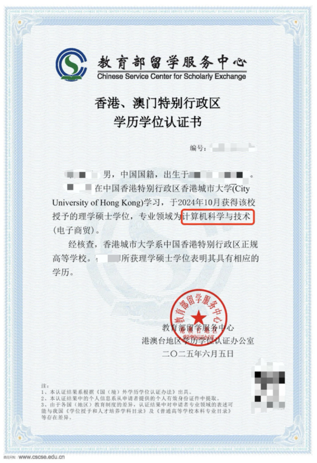

# 留服认证专业复核保姆级攻略 - 香港城市大学MScEC成功添加“计算机科学与技术”一级学科（通用模板与方法论）

[TOC]

## 🌟 项目简介

本项目记录并分享了作者在教育部留学服务中心（简称“留服中心”）学历学位认证完成后，成功进行专业领域复核的经历。作者毕业于香港城市大学(City University of Hong Kong)，获得了理学硕士（电子商贸）(MSc in Electronic Commerce)学位，初次认证结果为*“电子商贸”理学硕士*。通过复核，成功将专业名称修订为“**计算机科学与技术（电子商贸）**”理学硕士。

本仓库提供了一套完整的复核申请材料模板（和详细的方法论，希望能帮助到：
*   香港城市大学 (CityU) **MSc Electronic Commerce** 项目的学弟学妹。
*   其他境外院校毕业，希望在留服认证结果的专业名称中添加或调整一级学科/学科门类的同学。

**核心目的：** 解决因认证专业名称过于细分或与国内学科目录表述不一致，导致在求职（尤其是报考公务员、事业单位等）过程中，专业不符合岗位要求的问题。

*如果您觉得这个项目对您有帮助，欢迎点STAR~* 

**作者复核成功认证示例:**
 

## ⚠️ 重要提醒

*   **先认证，后复核：** 必须首先完成教育部的国（境）外学历学位认证，并拿到初始认证结果后，才能申请复核。
*   **复核时限：** 复核申请需要在初次认证结果出具之日起的 **12个月内** 提出。如果超过时限，可能需要邮件联系留服中心说明情况，请求开通复核通道。
*   **复核机会：** 通常情况下，针对同一份认证书的复核机会**只有一次**，且复核免费。务必认真准备，一次成功！
*   **材料的通用性与个性化：** 本仓库提供的材料均为模板，您需要根据自己的**实际情况（学校、专业、所修课程、申请的一级学科等）**进行修改和调整。**切勿直接照搬！**
*   **成功并非必然：** 本经验分享和材料仅供参考，不能保证您的复核申请一定成功。最终解释权归教育部留学服务中心所有。
*   **隐私保护：** 请在准备您自己的材料时，务必注意个人信息的保护。本仓库提供的所有模板均已做脱敏处理。
*   **关于附件的优先级（重要！）：**
    *   **强烈建议同时提交“学校开具的专业相似证明”（附件一）和“课程比对说明”（附件二至附件六）。**
    *   一般情况下，如果学校能顺利开具符合要求的“专业相似证明”（见附件一），这个证明的说服力会比较强。
    *   如果学校无法开具此类证明，或者开具的证明不够有力，那么详细的“课程比对说明”（附件二至附件六）就变得至关重要。
    *   即便学校能开具证明，补充课程比对材料也能进一步增强申请的说服力。

## 📖 留服认证专业复核流程

### 1. 什么是留服认证专业复核？
教育部留学服务中心国（境）外学历学位认证完成后，如果申请人对认证结果中的某些信息（如专业领域、证书名称、学习年限等）持有异议，或者希望根据国内特定需求（如就业、升学）对专业表述进行调整（如添加一级学科），可以向留服中心提出复核申请。

### 2. 为什么需要进行专业复核（以添加一级学科为例）？
*   **就业导向：** 国内很多企事业单位，尤其是公务员、事业单位招考时，其岗位专业要求会严格参照《学位授予和人才培养学科目录》中的学科门类、一级学科或二级学科。
*   **专业名称匹配：** 境外大学的专业名称可能与国内学科目录的表述不完全一致，或者认证结果直接翻译了专业名称，但未能体现其所属的更广泛的学科领域。例如，作者的“电子商贸”在某些招考中可能不被直接认可为“计算机科学与技术”类专业。
*   **提升竞争力：** 通过复核，将专业名称调整为更符合国内认知和需求的表述，可以有效避免因“专业不符”而在求职初期被筛掉的情况。

### 3. 怎么进行专业复核？
1.  **登录系统：** 登录教育部留学服务中心网上服务大厅 ([http://zwfw.cscse.edu.cn/](http://zwfw.cscse.edu.cn/))。
2.  **找到申请：** 在“用户中心”或“我的申请”中找到您已经认证完成的记录。
3.  **提起复核：** 在已完成的认证申请详情页面，会有“复核”按钮。
4.  **填写复核理由：** 清晰、简明地阐述您的复核请求和理由。例如：“申请将认证专业‘电子商贸’复核为‘计算机科学与技术（电子商贸）’，以便更好地符合国内相关岗位的专业要求。详细理由及证明材料见附件。”
5.  **上传材料：** 按照系统提示，将准备好的所有复核申请材料（PDF格式）上传。
6.  **提交等待：** 提交申请后，耐心等待留服中心的审核。复核过程不收取额外费用。审核时长因具体情况而异，作者的复核申请在一周左右出了结果。

## 📁 文件说明与使用指南

以下是本仓库包含的文件及其使用说明。请根据您的实际情况进行修改和使用。

---

### 📄 专业领域复核个人陈述（模板）.docx
*   **文件说明：** 这是向留服中心提交复核申请时，用于详细阐述复核理由、个人情况、课程与目标学科关联性的核心文书。
*   **如何使用我的模板：**
    1.  下载此 `.docx` 文件。
    2.  仔细阅读每一部分，特别是 `[占位符]` 或需要您填写/修改的内容。
    3.  **重点修改：**
        *   个人基本信息、留学信息、原认证结果。
        *   您希望复核成的专业名称（例如：计算机科学与技术（您的原专业名称））。
        *   详细论述您的课程内容与所申请一级学科的内在联系和高度相关性。可以结合附件二的课程对比结果来写。
        *   如果您有因专业名称问题求职受阻的经历，可以简要提及，增加说服力。
*   **你需要怎么改动：** 全文都需要根据您的个人情况进行彻底修改。模板仅提供一个结构和大体思路。**请务必用自己的语言和实际情况填充内容。**

---

### 📄 附件一、香港城市大学理学硕士（电子商贸）专业相似证明
这是一个包含多个文件的示例，展示了如何向学校申请开具“专业相似证明”。

*   **开具流程与说明**
    *   **文件说明：** 简要介绍了向香港城市大学相关部门（如此处示例的CS系）申请此类证明的流程和注意事项。
    *   **如何使用：** 主要供CityU同学参考。其他学校同学可以借鉴思路，寻找自己学校对应的学生服务部门、院系办公室或课程主管尝试开具。
    *   **你需要怎么改动：** 如果您不是CityU的，这部分内容对您的直接操作意义不大，但可以启发您如何联系自己学校。
*   **发送给学校的电子邮件模板**
    *   **文件说明：** 向学校请求开具专业相似/课程内容证明的邮件模板。
    *   **如何使用我的模板：**
        1.  根据您的学校、专业、个人信息以及您希望证明的相似学科（如“计算机科学与技术”）修改邮件内容。
        2.  清晰说明您需要证明的要点，以及证明的用途（用于中国教育部留学服务中心认证复核）。
        3.  附上您的学生信息、成绩单、毕业证等，方便学校核实。
    *   **你需要怎么改动：** 收件人、发件人、个人信息、具体诉求、附件等都需要替换为您自己的。
*   **专业相似证明样例**
    *   **文件说明：** 这是香港城市大学计算机系为作者的MSc Electronic Commerce专业开具的，证明其课程内容与“计算机科学与技术”领域相关的证明信样例。
    *   **如何使用：**
        *   **作为目标：** 您可以以此为参考，向您的学校申请类似的证明。
        *   **展示给学校：** 在与学校沟通时，可以（酌情）展示此样例，让学校明白您需要什么样的文件。
    *   **你需要怎么改动：** 这是最终产物样例，您无法直接改动。您需要努力让您的学校为您开出一份类似的、针对您个人情况的证明。**注意：不同学校、不同院系开具证明的意愿和能力不同，请做好心理准备。**

专业证明样例：

---

### 📄 附件二、与内地高校计算机科学与技术专业课程对比说明（模板）.docx
*   **文件说明：** 这是当学校无法开具理想的“专业相似证明”，或作为“专业相似证明”的强力补充时，需要您自己整理的核心论证材料。它通过对比您在境外所修课程与国内若干知名高校相关专业（如“计算机科学与技术”）硕士阶段的培养方案和核心课程，来证明您所学内容与目标一级学科的一致性。
*   **如何使用我的模板：**
    1.  **确定对比院校和专业：** 选择3所国内知名大学，其开设的您想关联的一级学科下的硕士专业（如“计算机科学与技术”）。
    2.  **收集课程信息：**
        *   您自己所修全部课程的官方课程大纲（Syllabus/Course Description），包含课程目标、主要内容、考核方式等。
        *   对比院校相关专业的官方研究生培养方案和核心课程列表。
    3.  **填写对比表格：** 模板中提供了一个课程对比表格的样式。您需要：
        *   列出您修读的核心课程（尤其是与目标一级学科相关的）。
        *   在对比院校的课程中找到与之内容相似或匹配的课程。
        *   简要说明两者的相似之处。
    4.  **撰写总结陈述：** 在表格前后，撰写总结性文字，强调您所学课程整体上覆盖了目标一级学科的核心知识领域。
*   **你需要怎么改动：**
    *   **您的课程列表和描述：** 必须替换为您自己真实修读的课程。
    *   **对比的内地高校及其课程：** 您需要自行查找并确定最适合您情况的对比院校和课程。附件四、五、六提供了作者当时选择的院校作为参考。
    *   **相似性分析：** 这是最核心的部分，需要您基于对课程内容的理解，认真进行比对和论述。**AI辅助：** 正如您在需求中提到的，您可以将您的课程列表、课程简介以及内地大学的课程列表发给ChatGPT等AI工具，请求它们帮助进行初步的比对、撰写相似性说明的初稿。**但请务必仔细核查和修改AI生成的内容，确保其准确性和专业性。**
    *   整体结构和措辞可参考模板，但具体内容必须是您自己的。

---

### 📄 附件三、香港城市大学MSc Electronic Commerce 2023届课程开设与培养方案.pdf
*   **文件说明：** 作者当年（2023届）香港城市大学MSc Electronic Commerce专业的官方课程设置和培养方案。
*   **如何使用：**
    *   CityU EC项目的同学：可以参考，但**务必下载您自己入学那一届或最新版本的官方培养方案**，因为课程可能会有变动。
    *   其他学校同学：此文件对您仅作示例参考，您需要提供您自己学校和专业的官方培养方案。
*   **你需要怎么改动：** 如果您是CityU EC后续届的同学，请从学校官网下载您对应届别的最新文档。如果您是其他学校/专业的，请替换为您自己学校的相应文件。

---

### 📄 附件四、南京大学计算机科学与技术研究生培养方案.pdf
### 📄 附件五、中国科学技术大学计算机科学与技术研究生培养方案.pdf
### 📄 附件六、中国科学院大学计算机科学与技术研究生培养方案.pdf
*   **文件说明：** 这三份文件是作者在准备“附件二、课程对比说明”时，选择的国内三所高校“计算机科学与技术”专业的研究生培养方案，用作课程比对的参照。
*   **如何使用：**
    *   您可以参考这三所学校的选择，但更建议您根据自己的实际情况和希望关联的一级学科，自行搜索并下载国内目标高校最新的、最相关的官方培养方案。
    *   这些文件是作为“附件二”的支撑材料，证明您课程对比的依据来源。
*   **你需要怎么改动：** 强烈建议您去目标对比院校的研究生院或相关院系官网，下载**最新版本**的培养方案。学校的培养方案会定期更新。

## 💡 AI 使用技巧提示

正如我在准备这些材料时发现的，ChatGPT等大型语言模型（LLM）可以在以下方面提供很大帮助：
*   **课程对比初稿：** 您可以将您的课程列表（中英文名称、课程简介）和内地几所大学对应专业的课程列表（通常在其研究生培养方案中）提供给AI，让它帮助您找出相似课程，并初步撰写相似性描述。
    *   例如，您可以提问：“请帮我对比以下两组课程列表。组A是我在香港城市大学电子商贸硕士专业修读的课程，组B是南京大学计算机科学与技术硕士专业的核心课程。请找出内容相似的课程对，并简要说明它们的相似性，以及我的课程如何体现了计算机科学与技术的知识。”
*   **个人陈述润色：** 在您完成个人陈述初稿后，可以请AI帮助检查语法、优化措辞，使其更流畅和专业。
*   **邮件模板草拟：** 请求学校开具证明的邮件，也可以让AI根据您的需求生成初稿。

**重要：** AI生成的内容**仅作为初稿和辅助**，您必须**亲自仔细审查、核对、修改和确认**所有信息的准确性和适用性。尤其是专业相关的论述，务必结合您自己的理解进行深化。

## 🤝 贡献

欢迎其他有相关经验的同学分享您的案例、模板或提出改进建议！您可以：
*   发起 Pull Request 贡献您的模板或修改。
*   创建 Issue 讨论问题或提出建议。

## 📝 License与使用提醒
 

This work is licensed under a [Creative Commons Attribution-NonCommercial 4.0 International License](http://creativecommons.org/licenses/by-nc/4.0/).

本项目采用 **Creative Commons Attribution-NonCommercial 4.0 International License** 授权，旨在无偿帮助广大留学生群体。 作者恳请： 

* 任何个人或组织在借鉴、使用本项目内容时，能够**严格遵守 CC BY-NC 4.0 许可协议的要求，特别是“署名”和“非商业性使用”条款。**
* 请务必**显著注明来源**（例如，链接到本 GitHub 仓库）。

 感谢您的理解与尊重，共同维护一个友好的开源共享环境。

